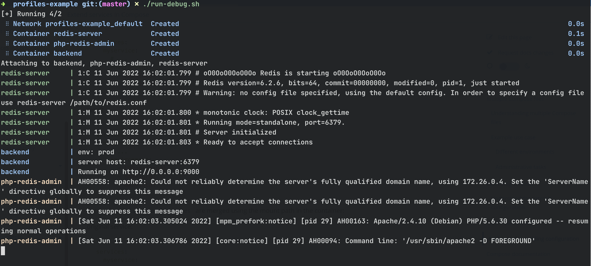
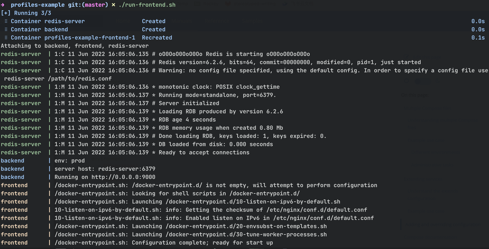

# profiles-example

通过 profile 来控制有哪些服务要启动和不启动。

## debug

如这里的 php-redis-admin 只会在 profile 指定 debug 时才会启动。执行：

```shell
$ docker compose --profile debug up
or 
$ zsh ./run.sh debug
```



## frontend

而这里的 frontend 则只在 profile 指定 frontend 时才启动：

```shell
$ docker compose --profile frontend
or 
$ zsh ./run.sh frontend
```

