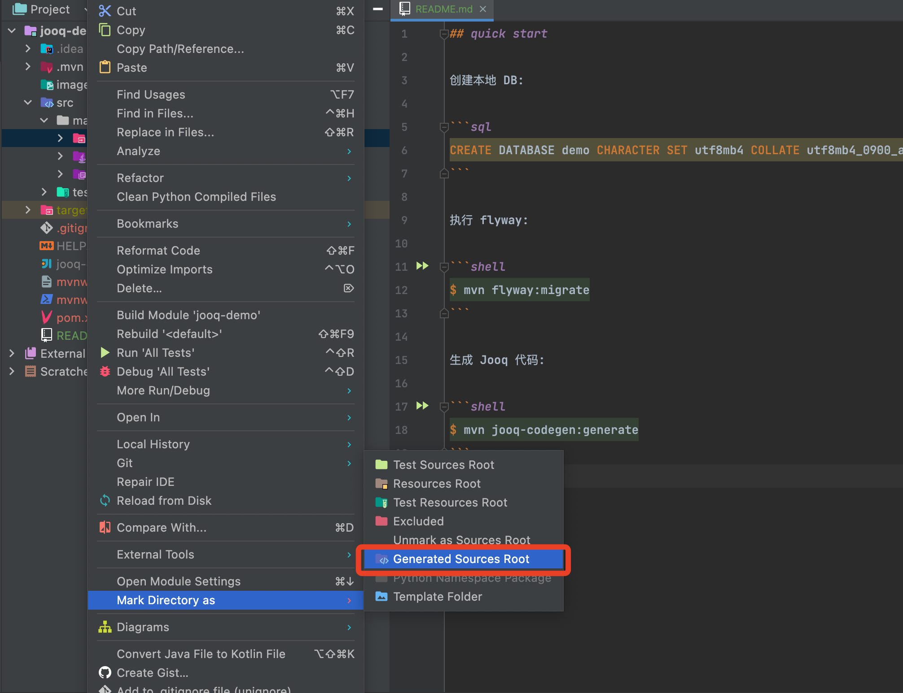

## quick start

创建本地 DB:

```sql
CREATE DATABASE demo CHARACTER SET utf8mb4 COLLATE utf8mb4_0900_ai_ci;
```

执行 flyway:

```shell
$ mvn flyway:migrate
```

生成 Jooq 代码:

```shell
$ mvn jooq-codegen:generate
```

在 IDEA 中, 将生成的 generated 目录标记为 src:


